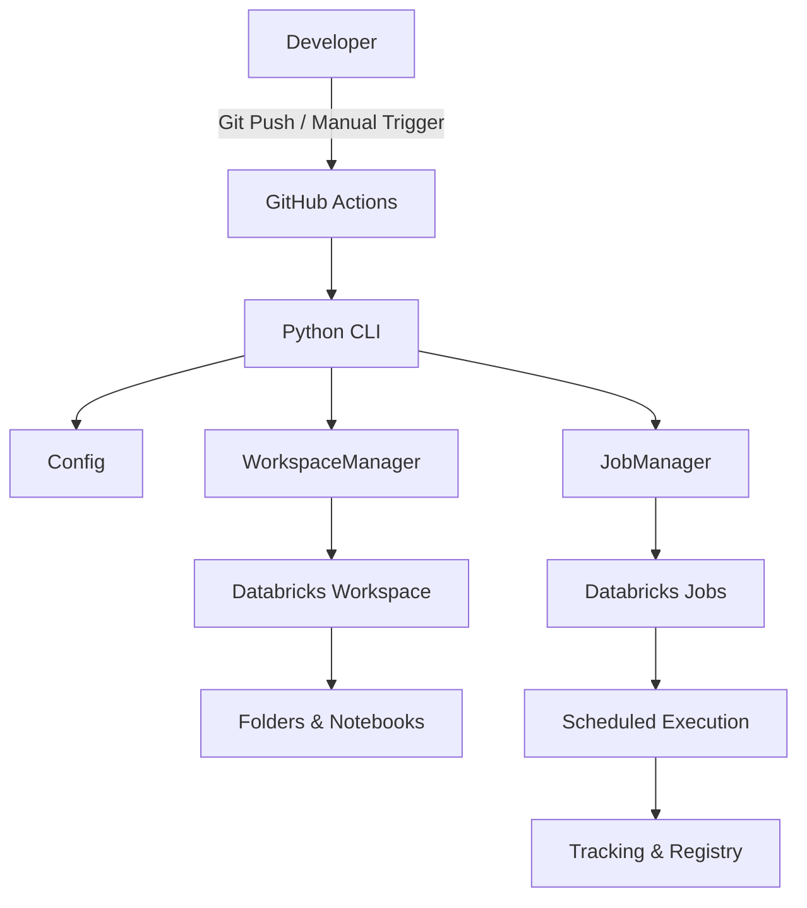

# Production-ready deployment architecture

## Overview

This repository implements a **production-ready deployment architecture** for orchestrating scheduled workloads on **Databricks** using **GitHub Actions** and a **Python-based CLI**.

The design focuses on:

- Repeatable and idempotent deployments
- Clear separation of environments (dev / staging / prod)
- Secure CI/CD automation
- Governance and traceability
- Maintainable and extensible code structure

This document describes the system architecture, deployment flow, and environment strategy.

---

## High-Level Architecture



---

## Core Components

### 1. Config

Responsible for all environment-specific configuration.

**Responsibilities**:
- Environment selection (dev, staging, prod)
- Workspace paths
- Registry/schema names
- Job naming conventions
- Feature flags (setup / deploy)

Centralizing configuration enables:
- Easy environment expansion
- Safer deployments
- No hard-coded values in logic

---

### 2. WorkspaceManager

Manages Databricks workspace operations.

**Responsibilities**:
- Create environment-specific workspace folders
- Upload or update notebooks
- Ensure idempotent workspace setup

Operations are safe to re-run and will not overwrite unintended resources.

---

### 3. JobManager

Handles the full lifecycle of Databricks jobs.

**Responsibilities**:
- Create jobs if they do not exist
- Update existing jobs
- Configure schedules
- Apply environment-specific settings

This ensures consistent job behavior across environments.

---

## Deployment Characteristics

### Idempotency

All deployment actions are idempotent:

- Resources are created only if missing
- Existing resources are updated, not duplicated
- Pipelines can be safely re-run

This is essential for CI/CD reliability.

---

## Environment Isolation Strategy

### Workspace Structure

```
/Workspace/Users/<user>/pipeline/
├── dev/
├── staging/
└── prod/
```

Each environment has isolated notebooks and jobs.

---

### Registry and Schema Separation

Separate schemas per environment:

```
workspace.dev
workspace.staging
workspace.prod
```

Benefits:
- Clear access boundaries
- Simplified permission management
- Reduced risk of cross-environment impact

---

### Job Naming Convention

```
dev-training       / dev-inference
staging-training   / staging-inference
prod-training      / prod-inference
```

This provides:
- Operational clarity
- Easier debugging
- Improved auditability

---

## CI/CD Automation

### GitHub Actions Triggers

**Automatic deployment**

```yaml
on:
  push:
    branches:
      - main
```

**Manual deployment**

```yaml
workflow_dispatch:
  inputs:
    environment:
      description: Target environment
      type: choice
      options:
        - dev
        - staging
        - prod
    setup:
      description: Run setup steps
      type: boolean
      default: false
    deploy:
      description: Deploy jobs
      type: boolean
      default: true
```

---

### Secure Credential Handling

- Credentials are stored using GitHub Secrets
- Environment-scoped secrets are enforced
- No credentials are exposed in logs or code

This supports controlled and auditable deployments.

---

## Deployment Flow

1. Developer pushes code or manually triggers workflow
2. GitHub Actions initializes the runner
3. Python dependencies are installed
4. Secrets are injected securely
5. CLI reads configuration
6. Workspace setup runs (if enabled)
7. Jobs are created or updated
8. Schedules are activated

---

## Job Execution Flow

- Jobs run on defined schedules
- Execution metadata is logged
- Artifacts are versioned and registered
- Results are available for downstream use

This ensures repeatable execution and traceability.

---

## Operational Benefits

- Deterministic deployments
- Strong environment isolation
- Minimal manual intervention
- Centralized governance
- Easy extensibility

---

## Future Enhancements

- Pre-deployment validation
- Post-deployment health checks
- Notifications on deployment status
- Approval gates for production
- Automated rollback mechanisms

---

## Summary

This architecture provides a **robust, production-ready deployment pipeline** built on standard CI/CD and platform engineering principles. It enables safe, repeatable deployments while maintaining strong separation of environments and operational control.

